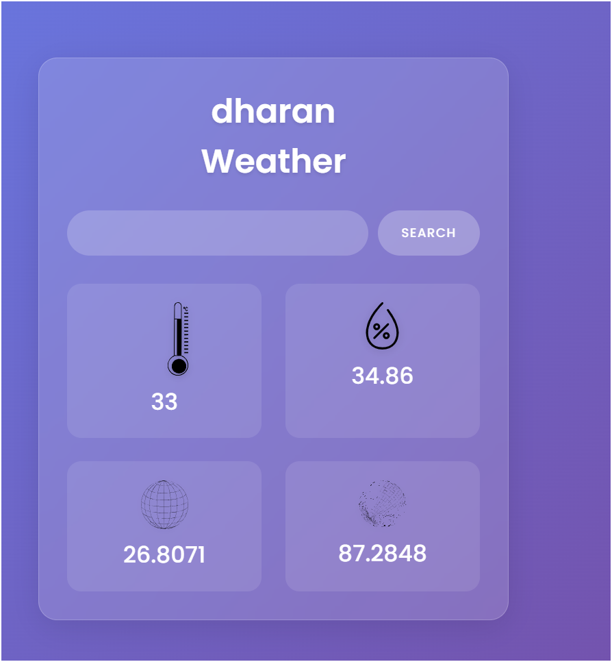

# 🌦️ Simple Weather App

This is a basic weather app built using **HTML, CSS, and JavaScript**. It shows the current temperature, humidity, latitude, and longitude for any city you search.

---

## ScreenShots of Weather App
    
## 🚀 Features

- 🔍 Search any city and get current weather data
- 🌡️ Shows temperature in Celsius
- 💧 Displays humidity
- 📍 Shows latitude and longitude
- 🧠 Uses a free weather API

---

## 📦 Technologies Used

- HTML
- CSS
- JavaScript (Vanilla)

---

## 🛠️ How It Works

1. User enters a city name and clicks the search button.
2. The app fetches weather data from the Visual Crossing API.
3. The data is displayed on the screen.

---

## 🔑 API Key

This app uses a free API key from Visual Crossing. You can use the one in the code or [get your own key](https://www.visualcrossing.com/weather-api).

---

## 🖼️ Example

Search for "Kathmandu" and you’ll see something like:

---

## 🤓 For Beginners

This is a good mini-project to:
- Practice using APIs
- Learn `fetch()`
- Work with DOM manipulation

---

## 📌 Note

This app shows only **current weather** — it doesn't include forecasts (yet 😉).

---

## 📁 How to Run

1. Download or clone this repo
2. Open `index.html` in your browser
3. Search for any city and get the weather!

---

## 🙌 Credits

Built with love by VIM Magar 💻🔥  
Weather data by Visual Crossing API

